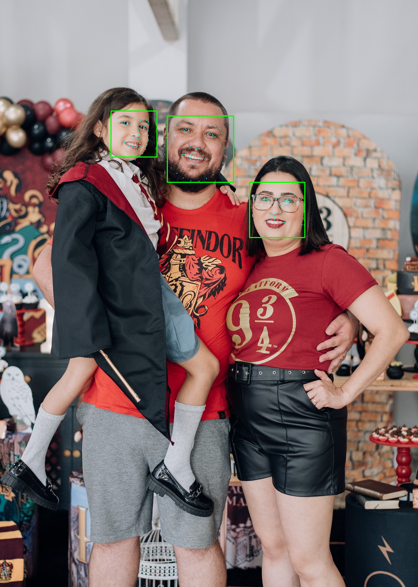

   

  

# Detecção Facial em imagem usando OpenCV e Dlib

Neste notebook eu apresento o código para fazer reconhecimento facial em fotos, neste caso usei uma foto da minha família e foi possível detectar os três rostos com facilidade, o arquivo treinado que usei no projeto `hape_predictor_68_face_landmarks.dat` pode ser baixado clicando [neste link]([https://medium.com/@jcp.paula17](https://github.com/italojs/facial-landmarks-recognition/raw/master/shape_predictor_68_face_landmarks.dat) e o código pode ser replicado com qualquer foto.

Abaixo está o notebook com o código completo.

* [Clique aqui para acessar o projeto](https://github.com/jcppaula/Deteccao_Facial_em_Imagem_com_Opencv_e_Dlib/blob/main/Detec%C3%A7%C3%A3o_facial_em_Imagem.ipynb)

**Sobre mim:**
* [LinkedIn](https://www.linkedin.com/in/j%C3%BAlio-c%C3%A9zar-de-paula-0b64b8226/)
* [Medium](https://medium.com/@jcp.paula17)
* [Portfólio](https://github.com/jcppaula/Portfolio)
